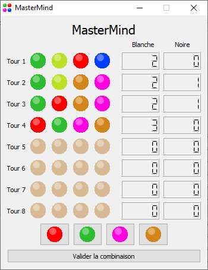

# MasterMind
MasterMind Game developed in C++ with the framework Qt

You will find a depository named "MasterMind App", that contains the .exe of the app and all the dependencies, just run MasterMind.exe, it works as a stand-alone app.

You will also find a depository named "MasterMind" which include all the sources files writen for that project, including the headers files (.h) and the sources files (.cpp)

